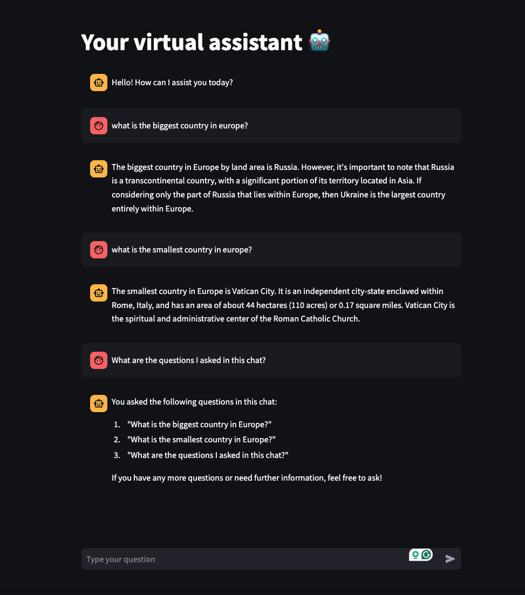

# Virtual Assistant using Streamlit and Language Models

This documentation provides an overview of how to build a virtual assistant using Streamlit and various language models, including Hugging Face Hub, OpenAI, and Ollama. It explains the code, provides links to libraries used, and includes a section for displaying the output of the project.

---

## Table of Contents
1. [Overview](#overview)
2. [Libraries Used](#libraries-used)
3. [Setup Instructions](#setup-instructions)
4. [Code Explanation](#code-explanation)
   - [Streamlit Configuration](#streamlit-configuration)
   - [Model Selection](#model-selection)
   - [Response Generation](#response-generation)
5. [Output Example](#output-example)
6. [Links and Resources](#links-and-resources)

---

## Overview
This project builds a conversational virtual assistant capable of responding to user queries. The assistant leverages:
- Hugging Face models
- OpenAI models
- Ollama's LLMs

Users interact with the assistant via a web interface built using [Streamlit](https://streamlit.io/).

---

## Libraries Used

### Core Libraries
1. **[Streamlit](https://streamlit.io/)**: Framework for building interactive web applications.
2. **[LangChain](https://www.langchain.com/)**: Framework for building applications powered by large language models.

### Additional Libraries
- **[langchain-core](https://github.com/langchain/langchain-core)**: Core functionality of LangChain.
- **[langchain-ollama](https://github.com/langchain/langchain-ollama)**: Adapter for Ollama's models.
- **[langchain-openai](https://github.com/langchain/langchain-openai)**: Adapter for OpenAI's models.
- **[langchain-huggingface](https://github.com/langchain/langchain-huggingface)**: Adapter for Hugging Face models.
- **[python-dotenv](https://github.com/theskumar/python-dotenv)**: For loading environment variables from a `.env` file.

---

## Setup Instructions

1. **Install Dependencies**:
   ```bash
   pip install streamlit langchain-core langchain-ollama langchain-openai langchain-huggingface python-dotenv
   ```

2. **Set Up Environment Variables**:
   Create a `.env` file in your project directory with the following content:
   ```env
   OPENAI_API_KEY=your_openai_api_key
   ```

3. **Run the Application**:
   ```bash
   streamlit run app.py
   ```

---

## Code Explanation

### Streamlit Configuration
The following code sets up Streamlit's page configuration and title:
```python
st.set_page_config(
  page_title="Your virtual assistant",
  page_icon="🤖",
)
st.title("Your virtual assistant 🤖")
```

### Model Selection
The code supports three model classes:
1. **Hugging Face Models**:
   ```python
   def model_hf_hub(model="meta-llama/Meta-Llama-3-8B-Instruct", temperature=0.1):
       llm = HuggingFaceEndpoint(
           repo_id=model,
           temperature=temperature,
           max_new_tokens=512,
           return_full_text=False,
           stop=["<|eot_id|>"],
       )
       return llm
   ```

2. **OpenAI Models**:
   ```python
   def model_openai(model="gpt-4o-mini", temperature=0.1):
       openai_api_key = os.getenv("OPENAI_API_KEY")
       os.environ["OPENAI_API_KEY"] = openai_api_key

       llm = ChatOpenAI(
           model_name=model,
           temperature=temperature,
       )
       return llm
   ```

3. **Ollama Models**:
   ```python
   def model_ollama(model="phi3", temperature=0.1):
       llm = ChatOllama(model=model, temperature=temperature)
       return llm
   ```

### Response Generation
User input and chat history are processed using LangChain's pipelines:
```python
def model_response(user_query, chat_history, model_class):
    if model_class == "hf_hub":
        llm = model_hf_hub()
    elif model_class == "openai":
        llm = model_openai()
    elif model_class == "ollama":
        llm = model_ollama()

    system_prompt = """
        You are a helpful assistant that answers general questions. Respond in {language}.
    """

    language = "English"

    user_prompt = "{input}" if not model_class.startswith("hf") else "<|begin_of_text|><|start_header_id|>user<|end_header_id|>
{input}<|eot_id|><|start_header_id|>assistant<|end_header_id|>"

    prompt_template = ChatPromptTemplate.from_messages([
        ("system", system_prompt),
        MessagesPlaceholder(variable_name="chat_history"),
        ("user", user_prompt),
    ])

    chain = prompt_template | llm | StrOutputParser()

    return chain.stream({
        "chat_history": chat_history,
        "input": user_query,
        "language": language,
    })
```

### Maintaining Chat History
Streamlit's session state stores and renders chat history:
```python
if "chat_history" not in st.session_state:
    st.session_state.chat_history = [AIMessage(content="Hello! How can I assist you today?")]

for message in st.session_state.chat_history:
    if isinstance(message, AIMessage):
        with st.chat_message("ai"):
            st.write(message.content)
    elif isinstance(message, HumanMessage):
        with st.chat_message("human"):
            st.write(message.content)
```

---

## Output Example

### Interaction Flow
1. User enters a query in the chat input box.
2. The assistant responds in real-time using the selected language model.

### Sample Output



---

## Links and Resources
- [Streamlit Documentation](https://docs.streamlit.io/)
- [LangChain Documentation](https://docs.langchain.com/)
- [Hugging Face Models](https://huggingface.co/models)
- [OpenAI API](https://platform.openai.com/docs/)
- [Ollama Models](https://ollama.ai/)

